# Introduction

An implementation of adaboost algorithm

# How to run

 - `script1.m` into matlab for the scatter plot
 - `script2.m` for the test error graph

# Notations

 - Every line is a weak classifier that are combined to form a strong classifier.
 - Pink lines represents p = +1 (i.e. red points (labeled +1) will be to the left/below the line), and vice-versa
for black lines.

# Results

## Dataset1

- Training error: 0.00%
- Test error: 26.00%

| 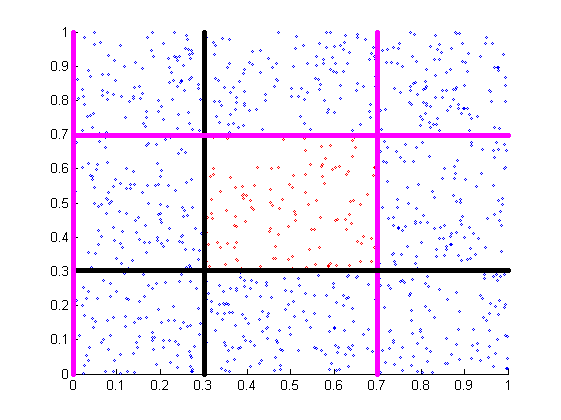{width=300} | 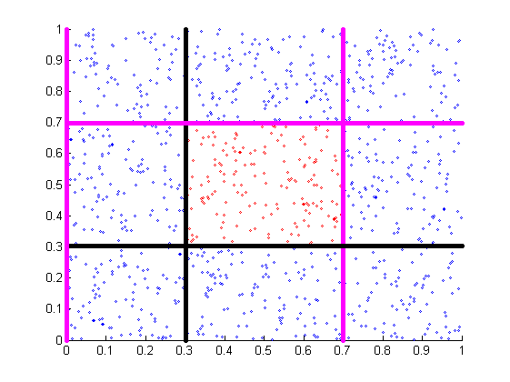{width=300} | 
|:|:|
| *Training data* | *Test data* |

| 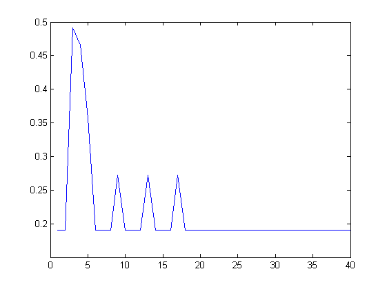{width=300} |
|:--:|
| *Test error* |

## Dataset2

- Training error: 20.60%
- Test error: 49.80%

| 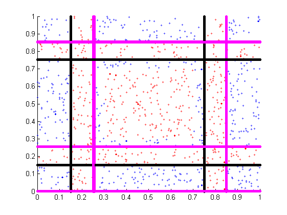{width=300} | 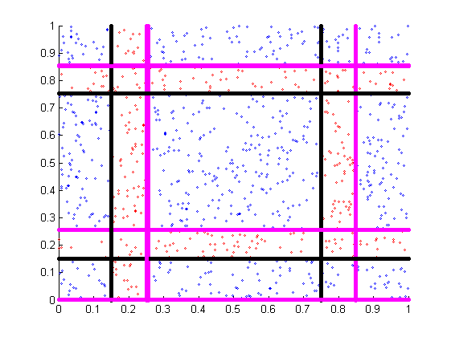{width=300} | 
|:|:|
| *Training data* | *Test data* |

| 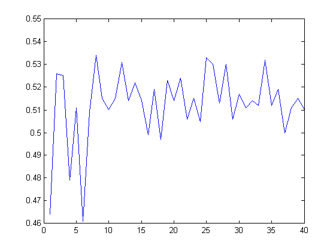{width=300} |
|:--:|
| *Test error* |

## Dataset3

- Training error: 3.90%
- Test error: 47.40%

| 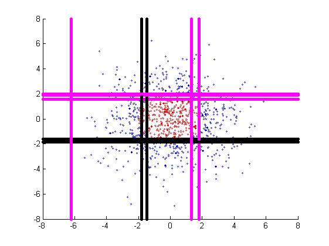{width=300} | 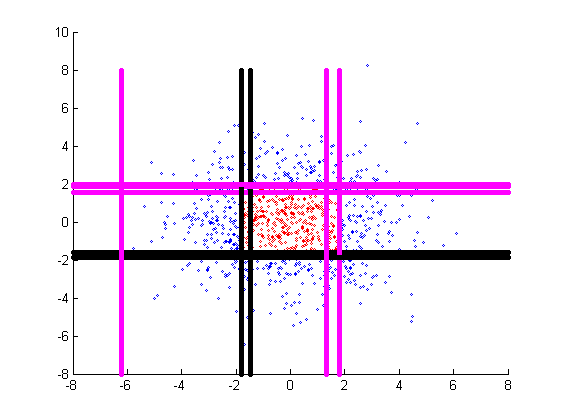{width=300} | 
|:|:|
| *Training data* | *Test data* |

| 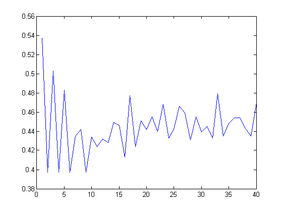{width=300} |
|:--:|
| *Test error* |

## Dataset4

- Training error: 17.20%
- Test error: 51.20%

| 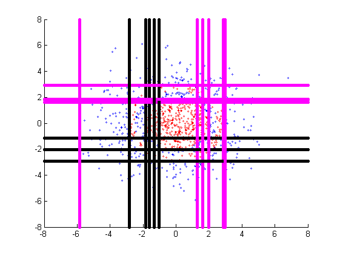{width=300} | 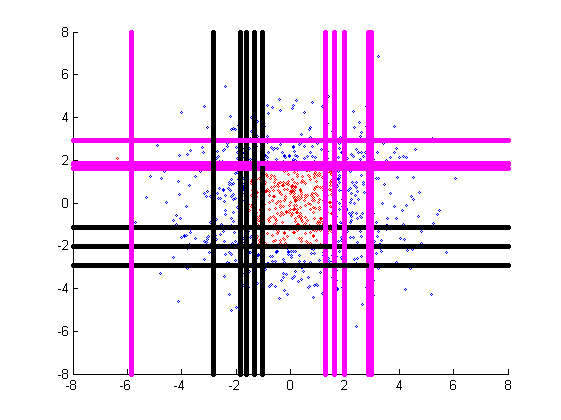{width=300} | 
|:|:|
| *Training data* | *Test data* |

| 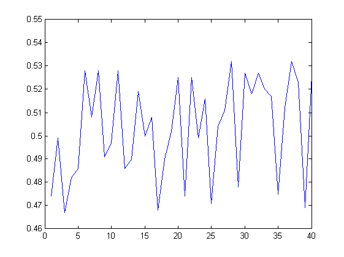{width=300} |
|:--:|
| *Test error* |

 - The peculiar thing about the dataset4 plot is that the test error increases with the number of iterations (ie
number of classifiers, T). This represents overfitting.

 - Remedy: It is difficult to represent such a dataset with lines. We can some other classifier, such as an ellipse,
to overcome this problem. A set of concentric ellipses of different radii (θ) and p (inside of outside) can easily
classify the data points.

